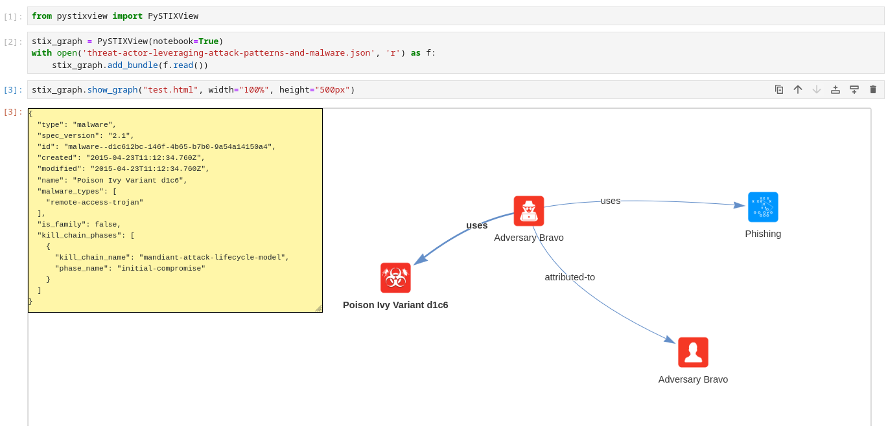

# PySTIXView
PySTXIView is a Python library to create and display STIX2 graphs.

PySTIXView is based on [pyvis](https://github.com/WestHealth/pyvis/) that allows you to create graph and visualize them in your browser or in Jupyter Notebook.

## Installation

### Requirements
- python3 (tested on python 3.12)
- pyvis
- [stix2](https://github.com/oasis-open/cti-python-stix2)

### Install from pip

### Install from source code

## Usage

Below is a simple example to create a graph from the STIX2 Bundle [Threat Actor Leveraging Attack Patterns and Malware](https://oasis-open.github.io/cti-documentation/examples/threat-actor-leveraging-attack-patterns-and-malware). (The JSON file is available at [](https://github.com/oasis-open/cti-documentation/blob/main/examples/example_json/threat-actor-leveraging-attack-patterns-and-malware.json))

```python
from pystixview import PySTIXView

stix_graph = PySTIXView("600px", "100%")
with open("threat-actor-leveraging-attack-patterns-and-malware.json", "r") as fd:
    stix_graph.add_bundle(fd.read())
stix_graph.save_graph("threat-actor-leveraging-attack-patterns-and-malware.html")
```

PySTIXView can be used also in Jupyter Notebook:




## Credits

- The resources used for examples and library tests are taken from [](https://oasis-open.github.io/cti-documentation/stix/examples.html).
- The images used in the library for the node icons are taken from [](https://github.com/freetaxii/stix2-graphics)
