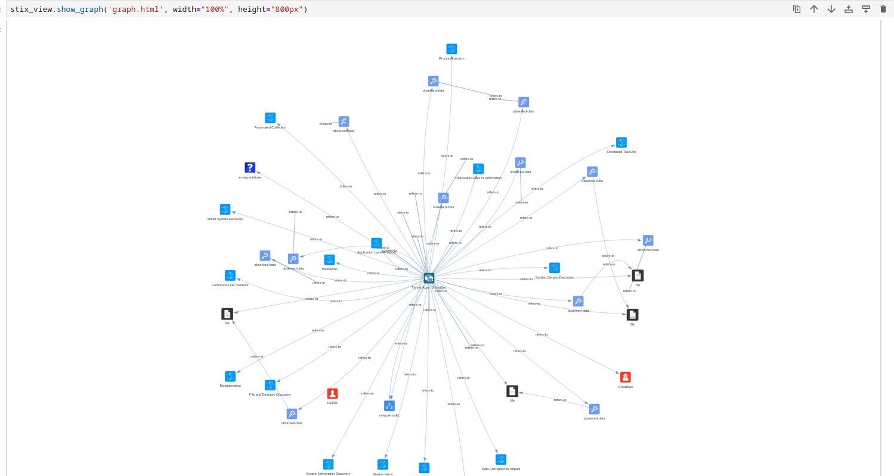
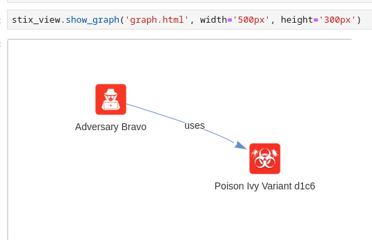
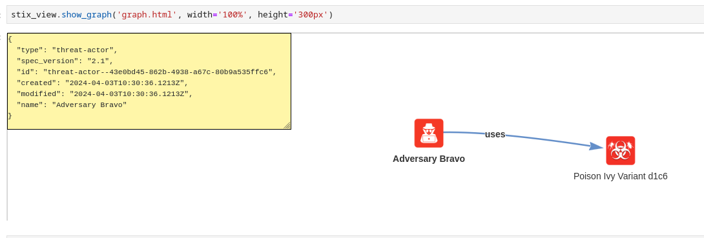
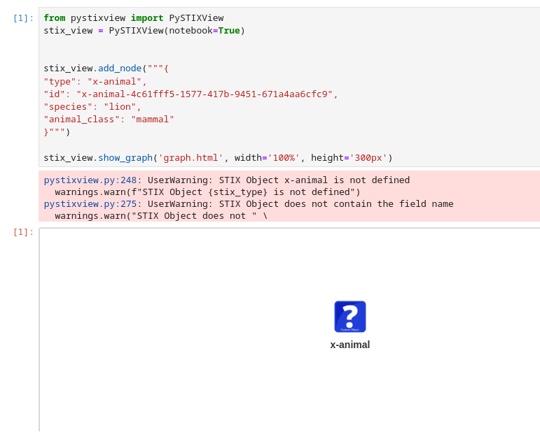
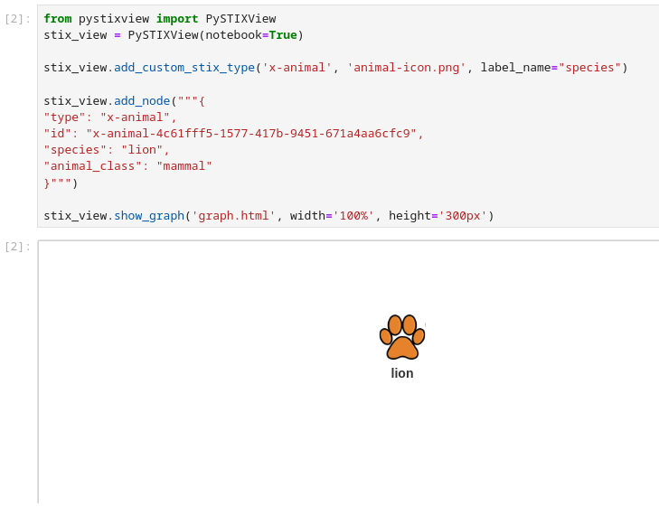

Usage
==============

Initialize a PySTIXView object to start building your graph. You can use the `notebook` option if you are going to use the library in a Jupyter Notebook.

.. code-block:: python
   
   from pystixview import PySTIXView
   
   stix_view = PySTIXView(notebook=True)

Add a node
------------

You can add a STIX object as graph node by passing a stix2 object, a string or a dict representing the object:

.. code-block:: python

   from stix2 import ThreatActor

   threat_actor = ThreatActor(name="Adversary Bravo")
   stix_view.add_node(threat_actor)

.. code-block:: python

   malware = """{
        "type": "malware",
        "spec_version": "2.1",
        "id": "malware--d1c612bc-146f-4b65-b7b0-9a54a14150a4",
        "created": "2015-04-23T11:12:34.760Z",
        "modified": "2015-04-23T11:12:34.760Z",
        "name": "Poison Ivy Variant d1c6",
        "malware_types": [
            "remote-access-trojan"
        ],
        "is_family": false,
        "kill_chain_phases": [
            {
                "kill_chain_name": "mandiant-attack-lifecycle-model",
                "phase_name": "initial-compromise"
            }
        ]
    }"""

   stix_view.add_node(malware)

Supported STIX Object
^^^^^^^^^^^^^^^^^^^^^^

PySTIXView supports the STIX Domain Object and Cyber Observable Object types:

- STIX Domain Objects
    - AttackPattern
        .. image:: https://raw.githubusercontent.com/vincenzocaputo/PySTIXView/main/pystixview/icons/sdo/attack-pattern/square-flat.png 
            :width: 64
    - Campaign
        .. image:: https://raw.githubusercontent.com/vincenzocaputo/PySTIXView/main/pystixview/icons/sdo/campaign/square-flat.png 
            :width: 64
    - CourseOfAction
        .. image:: https://raw.githubusercontent.com/vincenzocaputo/PySTIXView/main/pystixview/icons/sdo/course-of-action/square-flat.png 
            :width: 64
    - Grouping
        .. image:: https://raw.githubusercontent.com/vincenzocaputo/PySTIXView/main/pystixview/icons/sdo/grouping/square-flat.png 
            :width: 64
    - Identity
        .. image:: https://raw.githubusercontent.com/vincenzocaputo/PySTIXView/main/pystixview/icons/sdo/identity/square-flat.png 
            :width: 64
    - Indicator
        .. image:: https://raw.githubusercontent.com/vincenzocaputo/PySTIXView/main/pystixview/icons/sdo/indicator/square-flat.png 
            :width: 64
    - Infrastructure
        .. image:: https://raw.githubusercontent.com/vincenzocaputo/PySTIXView/main/pystixview/icons/sdo/infrastructure/square-flat.png 
            :width: 64
    - IntrusionSet
        .. image:: https://raw.githubusercontent.com/vincenzocaputo/PySTIXView/main/pystixview/icons/sdo/intrusion-set/square-flat.png 
            :width: 64
    - Location
        .. image:: https://raw.githubusercontent.com/vincenzocaputo/PySTIXView/main/pystixview/icons/sdo/location/square-flat.png 
            :width: 64
    - Malware
        .. image:: https://raw.githubusercontent.com/vincenzocaputo/PySTIXView/main/pystixview/icons/sdo/malware/square-flat.png 
            :width: 64
    - MalwareAnalysis
        .. image:: https://raw.githubusercontent.com/vincenzocaputo/PySTIXView/main/pystixview/icons/sdo/malware-analysis/square-flat.png 
            :width: 64
    - Note
        .. image:: https://raw.githubusercontent.com/vincenzocaputo/PySTIXView/main/pystixview/icons/sdo/note/square-flat.png 
            :width: 64
    - ObservedData
        .. image:: https://raw.githubusercontent.com/vincenzocaputo/PySTIXView/main/pystixview/icons/sdo/observed-data/square-flat.png 
            :width: 64
    - Opinion
        .. image:: https://raw.githubusercontent.com/vincenzocaputo/PySTIXView/main/pystixview/icons/sdo/opinion/square-flat.png 
            :width: 64
    - Report
        .. image:: https://raw.githubusercontent.com/vincenzocaputo/PySTIXView/main/pystixview/icons/sdo/report/square-flat.png 
            :width: 64
    - ThreatActor
        .. image:: https://raw.githubusercontent.com/vincenzocaputo/PySTIXView/main/pystixview/icons/sdo/threat-actor/square-flat.png 
            :width: 64
    - Tool
        .. image:: https://raw.githubusercontent.com/vincenzocaputo/PySTIXView/main/pystixview/icons/sdo/tool/square-flat.png 
            :width: 64
    - Vulnerability
        .. image:: https://raw.githubusercontent.com/vincenzocaputo/PySTIXView/main/pystixview/icons/sdo/vulnerability/square-flat.png 
            :width: 64

- STIX Cyber Observabel Object
    - AutonomousSystem
        .. image:: https://raw.githubusercontent.com/vincenzocaputo/PySTIXView/main/pystixview/icons/observable/autonomous-system/square-flat.png 
            :width: 64
    - DomainName
        .. image:: https://raw.githubusercontent.com/vincenzocaputo/PySTIXView/main/pystixview/icons/observable/domain-name/square-flat.png 
            :width: 64
    - EmailAddress
        .. image:: https://raw.githubusercontent.com/vincenzocaputo/PySTIXView/main/pystixview/icons/observable/email-address/square-flat.png 
            :width: 64
    - EmailMessage
        .. image:: https://raw.githubusercontent.com/vincenzocaputo/PySTIXView/main/pystixview/icons/observable/email-message/square-flat.png 
            :width: 64
    - File
        .. image:: https://raw.githubusercontent.com/vincenzocaputo/PySTIXView/main/pystixview/icons/observable/file/square-flat.png 
            :width: 64
    - IPv4Address
        .. image:: https://raw.githubusercontent.com/vincenzocaputo/PySTIXView/main/pystixview/icons/observable/ipv4-addr/square-flat.png 
            :width: 64
    - IPv6Address
        .. image:: https://raw.githubusercontent.com/vincenzocaputo/PySTIXView/main/pystixview/icons/observable/ipv6-addr/square-flat.png 
            :width: 64
    - MACAddress
        .. image:: https://raw.githubusercontent.com/vincenzocaputo/PySTIXView/main/pystixview/icons/observable/mac-addr/square-flat.png 
            :width: 64
    - NetworkTraffic
        .. image:: https://raw.githubusercontent.com/vincenzocaputo/PySTIXView/main/pystixview/icons/observable/network-traffic/square-flat.png 
            :width: 64
    - URL
        .. image:: https://raw.githubusercontent.com/vincenzocaputo/PySTIXView/main/pystixview/icons/observable/url/square-flat.png 
            :width: 64
    - UserAccount
        .. image:: https://raw.githubusercontent.com/vincenzocaputo/PySTIXView/main/pystixview/icons/observable/user-account/square-flat.png 
            :width: 64

Default Data Markings are also supported:

- TLP_AMBER
    .. image:: https://raw.githubusercontent.com/vincenzocaputo/PySTIXView/main/pystixview/icons/generic/tlp-amber-square-flat.png 
        :width: 64
- TLP_GREEN
    .. image:: https://raw.githubusercontent.com/vincenzocaputo/PySTIXView/main/pystixview/icons/generic/tlp-green-square-flat.png 
        :width: 64
- TLP_WHITE
    .. image:: https://raw.githubusercontent.com/vincenzocaputo/PySTIXView/main/pystixview/icons/generic/tlp-white-square-flat.png 
        :width: 64
- TLP_RED
    .. image:: https://raw.githubusercontent.com/vincenzocaputo/PySTIXView/main/pystixview/icons/generic/tlp-red-square-flat.png 
        :width: 64

You can also add your custom STIX Object to the graph. See this section for details.

Using Bundles
---------------

A Bundle is a collection of STIX Objects. You can create a graph from a Bundle by using the function :func:`pystixview.PySTIXView.add_bundle`:

.. code-block:: python

    stix_view = PySTIXView()
    with open("threat-actor-leveraging-attack-patterns-and-malware.json", "r") as fd:
        stix_view.add_bundle(fd.read())

This feature is particularly suitable for handling a large number of STIX Objects, saved in JSON files or coming from TAXII servers or other sources. For example, you can use PySTIXView to display the graph of the STIX representation of a MISP Event, using the library `MISPtoSTIX21Parser <https://github.com/MISP/misp-stix>`_:

.. code-block:: python

    from pystixview import PySTIXView
    from misp_stix_converter import MISPtoSTIX21Parser

    # Get a MISPEvent object from your MISP instance
    # ...
    
    parser = MISPtoSTIX21Parser()
    parser.parse_misp_event(event)
    bundle = parser.bundle

    stix_view = PySTIXView(notebook=True)
    stix_view.add_bundle(bundle)

Add a relationship
--------------------

You can add a relationship between two nodes by providing a stix2 Relationship object, a string or dict representing the relationship.

.. code-block:: python

    relationship = {
        "type": "relationship",
        "spec_version": "2.1",
        "id": "relationship--d44019b6-b8f7-4cb3-837e-7fd3c5724b87",
        "created": "2020-02-29T18:18:08.661Z",
        "modified": "2020-02-29T18:18:08.661Z",
        "relationship_type": "uses",
        "source_ref": threat_actor['id'],
        "target_ref": "malware--d1c612bc-146f-4b65-b7b0-9a54a14150a4"
    }

    stix_view.add_relationship(relationship)

Show graph
---------------

Once you have added nodes to the graph and connected them via relationship, you can generate the HTML to render the graph. You can use the function :func:`pystixview.PySTIXView.save_graph` to save an HTML file or the function :func:`pystixview.PySTIXView.show_graph` to get the HTML code. The latter is especially useful within Jupyter Notebook, since the graph will be visible in the notebook via an iframe.

.. code-block:: python

   stix_view.show_graph('graph.html', width='500px', height='300px')

Clicking on a node will display the JSON content of the STIX Object:

You can modify the visualization of the graph by using several options to filter and customize graph nodes. In particular, the `style` option let you to choose the look and feel of node icons. You can pick from the following styles:

- square-flat (default)
- square-dark
- square-lite
- noback-flat
- noback-dark
- round-flat

Custom STIX Object Types
--------------------------

You can add also custom STIX Objects as nodes to the graph, however a warning will be raised and a default icon will be used:

It is recommended to "register" the custom STIX object by providing a custom icon (or a color). You can also select which field use as node label:

.. code-block:: python

    from stix2 import CustomObject, properties
    
    stix_view.add_node("""{
        "type": "x-animal",
        "id": "x-animal-4c61fff5-1577-417b-9451-671a4aa6cfc9",
        "species": "lion",
        "animal_class": "mammal"
    }""")
    stix_view.show_graph('graph.html', width='100%', height='600px')

You can as well use stix2 CustomObject to add the nodes to the graph:

.. code-block:: python
   
    from stix2 import CustomObject, properties
    @CustomObject('x-animal', [
       ('species', properties.StringProperty(required=True)),
       ('animal_class', properties.StringProperty()),
    ])
    class Animal(object):
      def __init__(self, animal_class=None, **kwargs):
         if animal_class and animal_class not in ['mammal', 'bird', 'fish', 'reptile']:
             raise ValueError("'%s' is not a recognized class of animal." % animal_class)
    
    stix_view.add_custom_stix_type('x-animal', 'animal-icon.png', label_name="species")
    animal = Animal(species="lion",
                animal_class="mammal")
    
    stix_view.add_node(animal)

    stix_view.show_graph('graph.html', width='100%', height='600px')
